# Manual de Eva

### Guía del agente de opciones

_Cómo leer el flujo institucional para tomar decisiones informadas._

> Eva no es asesor financiero ni ejecuta órdenes. Te da contexto; las decisiones y el riesgo son tuyas.

## 1. ¿Qué es Eva?

Eva es un agente de análisis de **opciones**. Su trabajo es detectar **actividad inusual del dinero institucional** y darte **contexto accionable**: hacia dónde apuesta el dinero grande, con cuánta convicción, dónde están los muros de precio, y qué tan fiable es la señal.

Eva **no predice el futuro** ni **ejecuta órdenes**, y **no es asesoría de inversión**. Te da inteligencia; las decisiones y el riesgo son tuyos.

## 2. Las 6 secciones del navegador

| Sección | Para qué sirve |
|---|---|
| Ticker | Análisis completo de una acción: sentiment, flujo, muros y sub-agentes. |
| Ideas | Radar de TODO el mercado: dónde hay flujo institucional notable ahora mismo (§8). |
| Wheel | Screener de la estrategia Wheel (venta de puts cash-secured para ingreso). |
| Time & Sales | El tape en crudo: cada operación notable con su agresor y griegas. |
| 0DTE | Opciones que expiran el mismo día (sección en construcción). |
| EVA Credit Spread | La estrategia validada: forward-test en vivo del credit spread filtrado por convicción de EVA. |

## 3. La vista Ticker: motor y vista

Arriba de todo hay **dos toggles**, uno encima del otro. Primero eliges el **motor** (Original o EVA); debajo, la **vista** (Estudiante o Pro).

### El toggle Original | EVA — elige qué motor manda

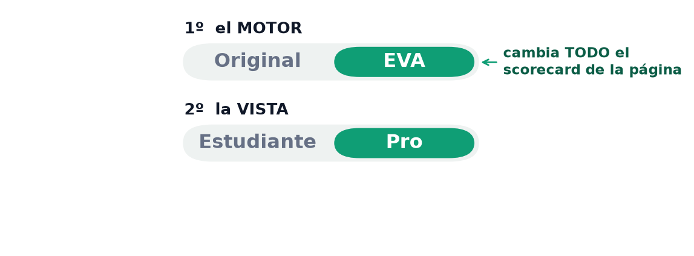

_Dos toggles apilados: arriba el MOTOR (Original o EVA), abajo la VISTA (Estudiante o Pro). El motor que elijas cambia el scorecard de TODA la página._

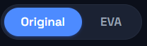

_Así se ve en la app: el toggle real (aquí en «Original»). Al pasarlo a EVA se recalculan a la vez la fuerza del AI Sentiment, el scorecard y el texto del veredicto — la dirección y los precios objetivo NO cambian._

**Original** es el sistema base de Victor, congelado como referencia del pasado. **EVA** es la versión recalibrada (la Convicción pesa más — ver §6). Al cambiarlo, se actualizan a la vez la **fuerza del AI Sentiment**, el **scorecard** y el texto de señales del veredicto — tanto en Estudiante como en Pro.

> 💡 **Qué cambia y qué NO al mover Original ⇄ EVA.** CAMBIA todo lo que depende de los **pesos del scorecard**: la fuerza, el scorecard y el texto de «señales fuertes/débiles». NO cambia los **precios objetivo** (alcista/base/bajista, que salen de los muros de gamma / GEX) ni la **dirección** del triángulo (que sale del flujo). Es a propósito: a nivel de un ticker, EVA y Victor se diferencian solo en los **6 pesos**. Victor no se borra — EVA se pone al lado como respaldo.

Y dentro de cualquiera de los dos motores, eliges la vista:

| Modo | Qué ves |
|---|---|
| Estudiante | Lo esencial y simple: un veredicto, 3 escenarios (alcista/base/bajista) y el precio esperado. |
| Pro | Todo el detalle: el resumen, el sentiment, los 6 sub-agentes, los muros y el feed de operaciones. |

Recomendación: empieza en **Estudiante**; sube a **Pro** cuando quieras el detalle.

> 🧭 **CÓMO USAR ESTA DIVISIÓN — Ticker** **Qué ves:** el análisis COMPLETO de UNA acción: dirección del flujo, fuerza, los 6 sub-agentes, muros y precio esperado. **Qué haces:** léela de arriba abajo — primero el resumen y el veredicto, luego el detalle. Es tu 'segunda opinión' antes de tocar un ticker (muchas veces llegas aquí desde una idea de la división Ideas). **NO es:** una orden de compra ni una predicción garantizada. Es contexto sobre hacia dónde apunta el dinero y qué tan fiable es. **Crúzala con:** **(1) el aviso de liquidez (§10)** — *por qué:* una señal sobre datos ilíquidos no vale nada; *cómo:* si ves «datos poco fiables», PARA ahí. **(2) los muros/GEX (§7)** — *por qué:* dicen dónde el precio suele frenar; *cómo:* si el flujo es alcista y hay un muro de calls justo arriba, ese muro es tu techo probable (buen sitio para tomar ganancia). **(3) el historial (§11)** — *por qué:* mide si el patrón funcionó antes; *cómo:* un hit-rate verde alto da confianza, uno rojo es bandera. *Ejemplo:* flujo bullish fuerte en AAPL + muro de calls en $240 + historial 80% → el escenario alcista hacia $240 tiene respaldo real, no es corazonada.

## 4. El resumen en lenguaje sencillo

Al **tope del modo Pro** hay un párrafo que traduce todos los números a una frase que puedes leer en 5 segundos. Ejemplo real (AAPL):

> 📉 El flujo se inclina bajista — Flujo institucional pesado en AAPL ($24.1M notable), concentrado en calls y puts, ejecutado agresivo (comprando al ask) — 73% del dinero entró al ask, Convicción 8/10. El posicionamiento se inclina BAJISTA.

Léelo primero; luego baja y ata cada dato con el detalle. **Este resumen se arma solo con los datos reales, no lo inventa ningún modelo.**

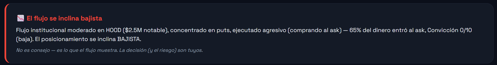

_Así se ve en la app (HOOD): «El flujo se inclina bajista — flujo institucional moderado ($2.5M notable), concentrado en puts, agresivo (65% del dinero al ask), Convicción 0/10 → BAJISTA». Una frase que resume todo el detalle de abajo._

Y justo debajo, EVA pega las **noticias** del activo y las etiqueta (positiva / neutral / negativa), para contrastar lo que dice la prensa con lo que apuesta el dinero en opciones:

_Así se ve en la app (HOOD): titulares con su fuente y antigüedad, cada uno etiquetado — «Introducing Robinhood Ventures Fund II» (positiva, hace 9h), el beat de Q2 (+32% ventas), y el price target de Bernstein a $160 (+23%). Cuando la prensa y el flujo apuntan igual, la señal pesa más._

## 5. AI Sentiment Score (direccional)

Este medidor te dice **dos cosas separadas** — y es normal confundirlas, porque las dos son 'intensidades'. La clave: son intensidades de **cosas distintas**.

| Qué es | Qué mide | Qué intensidad es |
|---|---|---|
| El triángulo (posición en la barra) | Hacia qué lado se inclina el flujo, y cuánto: bien bajista → bajista → neutral → alcista → bien alcista. | Intensidad de la **dirección** |
| La «fuerza» (el número 0-100) | Cuánto respaldo real tiene esa lectura, sin importar el lado. | Intensidad de la **convicción / calidad** |

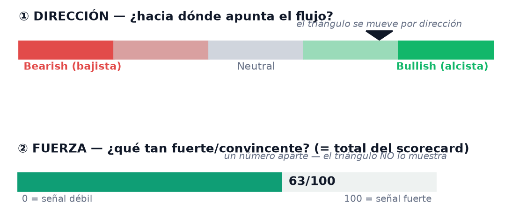

_Dos barras, dos preguntas: ① la barra de dirección (el triángulo se mueve por hacia dónde apunta el flujo) y ② el medidor de fuerza (cuánto respaldo hay detrás, un número aparte)._

_Así se ve en la app (HOOD): etiqueta **Bearish**, fuerza baja **30/100**. El desglose explica por qué es baja: solo 3 de 6 sub-agentes puntuaron (Agresividad, Estructura y Confirmación en 60; Convicción, Inusualidad y Contexto IV en 0, que arrastran el promedio hacia abajo)._

**La prueba de que son distintas:** el triángulo y la fuerza pueden ir por separado.

| Escenario del flujo | Triángulo | Fuerza | Cómo leerlo |
|---|---|---|---|
| 90% alcista, pero son 3 contratos ilíquidos de un centavo | bien a la derecha | baja (20) | Apunta alcista… pero no te fíes. |
| 90% alcista con millones en primas, agresivo, inusual | bien a la derecha | alta (85) | Apunta alcista **y con respaldo**. |
| Muchísimo dinero real y agresivo, mitad a calls / mitad a puts | al centro (neutral) | alta (80) | Batalla enorme, pero nadie gana todavía. |

Fíjate: en los dos primeros el **triángulo está en el mismo sitio** pero la **fuerza cambia** — si el triángulo midiera la fuerza, no podría. Y en el tercero hay **mucha fuerza con el triángulo al centro**. Son ejes independientes.

> 💡 **¿Te confunde la palabra «fuerza»? Se puede renombrar (opcional).** El triángulo y el número miden dos intensidades distintas, y «fuerza» se presta a confusión. Si prefieres, cambiamos solo las **etiquetas** en la app (no toca ningún cálculo): el **triángulo** → «**Inclinación del flujo**» (cuán alcista/bajista); el **número** → «**Respaldo**», «**Convicción**» o «**Calidad de la señal**» en vez de «fuerza». Dime si te gusta alguna o lo dejamos igual.

## 6. Los 6 sub-agentes (el corazón de Eva)

El sentiment sale del promedio de estos 6. Cada uno mira una cosa distinta:

| Sub-agente | Qué mide / qué buscar | Peso · Victor → EVA |
|---|---|---|
| Agresividad | ¿Compran al ASK con fuerza? Mucho dinero al ask = urgencia direccional. | 20% → **10%** ↓ |
| Convicción | Calidad del flujo: spread apretado, un solo lado dominante, ejecución fuerte. | 20% → **30%** ↑ |
| Inusualidad | ¿Griegas de grado institucional? Tamaño, delta alta, vencimientos, gamma. | 20% → 20% |
| Estructura | ¿Dónde se acumula el dinero? (muros GEX) y la liquidez de la cadena. | 15% → 15% |
| Contexto IV | ¿La volatilidad implícita está limpia o inflada? Evita pagar prima cara. | 10% → **15%** ↑ |
| Confirmación de Precio | ¿El precio VALIDÓ flujos pasados o los absorbió? (el backtest, ver §11). | 15% → **10%** ↓ |

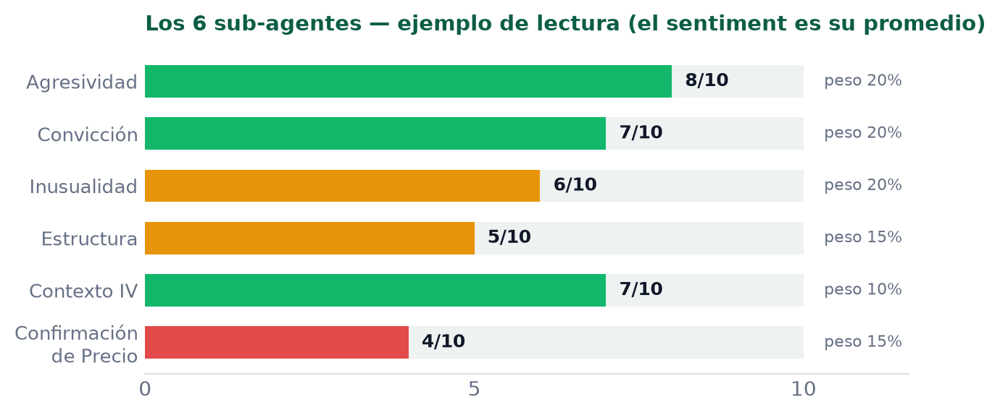

_Cada sub-agente puntúa 0-10; el AI Sentiment Score es su promedio ponderado por los pesos de EVA (la calibración recalibrada — la Convicción manda con 30%)._

_Así se ve en la app: el scorecard **Original** (Victor) de HOOD, **Total 30/100**. Cada tarjeta trae la nota (0-10) y los puntos que aporta: Agresividad 6/10 → 12/20, Estructura 6/10 → 9/15, Confirmación 6/10 → 9/15; los otros tres en 0. Suma: 12 + 9 + 9 = 30. (Con el toggle en EVA los pesos cambian — §3.)_

> 💡 **¿Por qué la columna muestra dos pesos (Victor → EVA)?** «Victor» es la calibración ORIGINAL, que dejamos **congelada** como referencia del pasado. «EVA» es la **recalibrada**. Lo que hicimos: backtesteamos cada sub-agente sobre ~1 año para ver cuál de verdad **separa** los trades ganadores de los perdedores. La **Convicción** (liquidez + calidad del flujo) fue la que mejor lo hizo → le **subimos** el peso (20→30%). La **Agresividad** casi no separaba → la **bajamos** (20→10%). Contexto IV subió y Confirmación bajó por lo mismo. Para elegir cuál ves: vista Ticker → **Pro** → «Detalle de sub-agentes» → toggle **Original | EVA**.

### El scorecard puesto a prueba (bitácora — se actualiza)

No basta con saber qué mira cada sub-agente: hay que medir cuáles de verdad dan ventaja. Aquí anoto cada avance de backtest, con números reales, para irte enseñando el score. (n = tamaño de la muestra: cuántos casos entraron en la prueba; mientras más grande, más confiable el %.)

| Fecha | Qué se probó | Resultado |
|---|---|---|
| 2026-07-31 | Comprar el contrato del flujo (**calls y puts**, en largo; sostener 10 sesiones) filtrando por la señal **Inusualidad** — que ya junta 6 sub-señales: **tamaño + delta + theta + gamma + patas + vencimiento** — y cruzándola con el **Agresor** (compra al ask). | **55% de win** con Inusualidad alta (vs 39% baja). El cruce con el agresor apuntó igual, con muestra chica. Preliminar: **n = 29 casos**, 3 tickers; falta re-correr limpio. |

_Resultados preliminares de backtest, NO promesas ni consejo. El fin es didáctico: aprender, con evidencia, qué señales separan ganadores de perdedores. Un número prometedor con muestra chica puede evaporarse con más datos._

## 7. Muros de strikes (GEX) y movimiento esperado

En la tarjeta PRO 'Strike Walls' ves:

| Elemento | Qué significa |
|---|---|
| Muro de calls (dorado) | Strike con mucho dinero en calls arriba del precio = suele actuar de RESISTENCIA. |
| Muro de puts (morado) | Strike con mucho dinero en puts abajo del precio = suele actuar de SOPORTE. |
| Nivel imán | El nivel de mayor peso: hacia donde el precio tiende a gravitar. |
| Cono de movimiento esperado | El rango estadístico (±1σ ≈ 68%, ±2σ ≈ 95%) según IV y tiempo. |

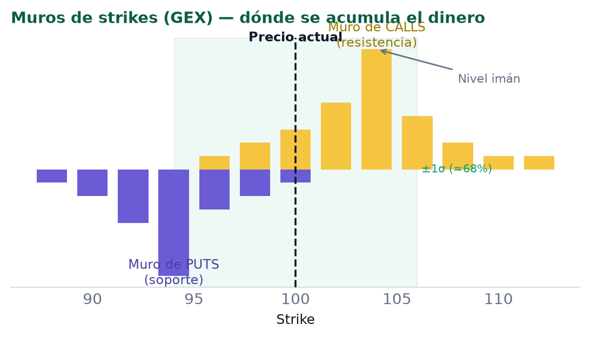

_Oro = muros de calls (resistencia) arriba del precio; morado = muros de puts (soporte) abajo; la franja es el cono ±1σ._

_Así se ve en la app (HOOD, Pro): los muros reales — calls (dorado) en $93 / $92 / $90 / $89 / $85 y puts (morado) en $80 / $75, con su % de peso. Precio ahora $86.25, nivel imán $90 (25% del peso), movimiento esperado ±14.3% (1σ) e IV usada 61.2%._

_Y el **GEX Heatmap**: el dinero de gamma por strike (filas) y por vencimiento (columnas). Verde = el dealer estabiliza (el precio revierte); morado = amplifica (acelera). En HOOD se concentra en $90-$93 ($4M+ por strike). GEX neto **$21.8M, régimen γ+** → conviene desvanecer los extremos, no perseguirlos._

### De dónde salen los 3 precios (alcista, base, bajista)

Esos mismos muros arman la tarjeta '¿Cómo se podría mover?', con 3 precios. No es un pronóstico mágico — es la mecánica de los muros de gamma. Desde cero:

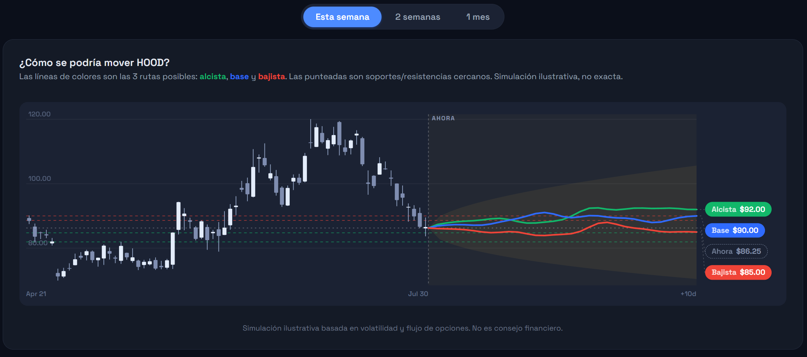

_La tarjeta en EVA (HOOD): alcista $92, base $90, bajista $85. Esto es lo que vamos a explicar._

**Quién te vende la opción:** del otro lado hay un **dealer** (la casa). No apuesta dirección; para no arriesgarse, cada vez que el precio se mueve compra o vende la acción para equilibrarse. Ese movimiento **obligado** empuja el precio.

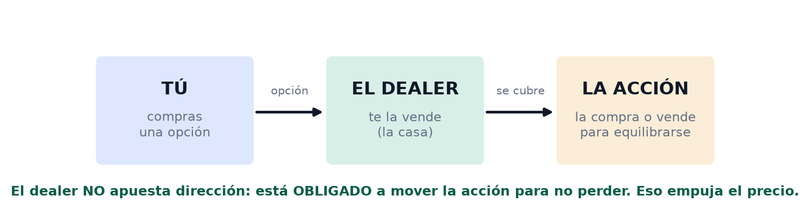

_El dealer está obligado a mover la acción — es mecánica, no opinión._

**El muro (imán):** en los strikes con MUCHAS opciones, el dealer se cubre fuerte: si el precio sube, vende (lo baja); si baja, compra (lo sube). Como las paredes de un valle, el precio rueda al fondo y se queda. Ese es el **muro** o **imán**.

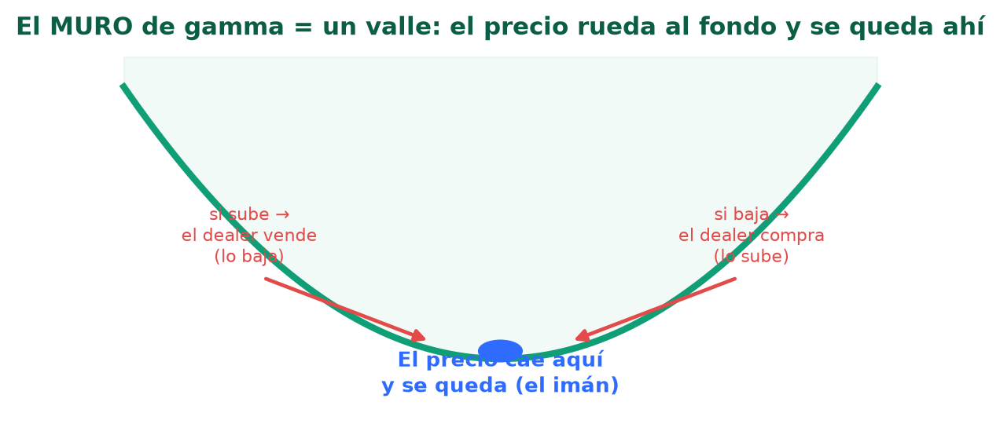

_El muro imanta el precio hacia su fondo._

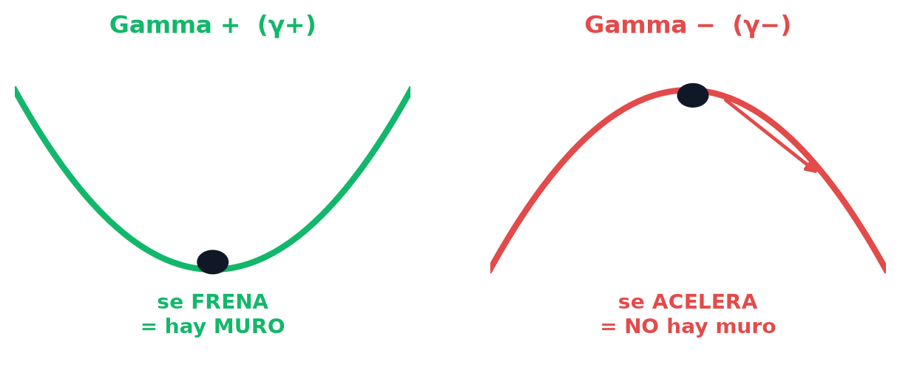

_Gamma + = el precio se frena (hay muro). Gamma − = se acelera (no hay muro — cuidado)._

**Los 3 precios salen de los muros:** **Base** = el imán dominante (el strike con más gamma). **Alcista** = el muro más fuerte por encima. **Bajista** = el muro más fuerte por debajo. Si no hay muro de un lado, cae al borde de **±1σ** del cono.

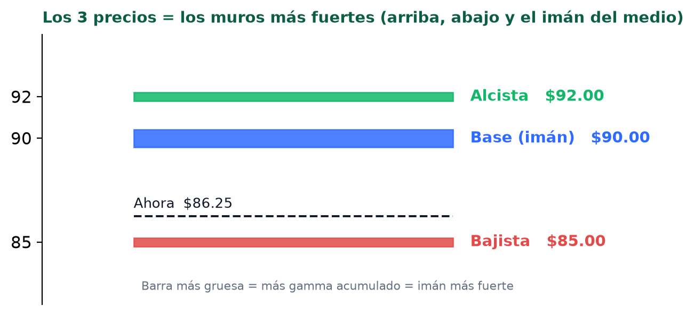

_Los 3 precios = los muros; el más grueso (más gamma) es el imán._

> 💡 Para ti: el muro es donde el precio suele FRENAR (buen lugar para tomar ganancia o vender prima por fuera); la zona γ− es donde ACELERA (ahí no vendas prima corta). Son niveles REALES (miles de contratos), no líneas a ojo — solo fiables con liquidez.

_Así se ve en la app (HOOD, Pro): **Prediction Pro** junta los 3 escenarios — BEAR $89 (-2.2%, 93% de tocarlo), BASE $90 (el imán, 17% del peso del mapa) y BULL $92 (+1.1%, 88%). Confianza 55%, señales 30/100. Abajo lista los 3 flujos más grandes que sostienen la lectura._

### ¿Por qué los 3 plazos dan el MISMO precio?

Porque los muros son precios **fijos** — no dependen del tiempo. Cambiar el plazo mueve el ancho del cono y las probabilidades, pero **no** los muros. Si están pegados al precio actual (como en HOOD), caben hasta en 'esta semana' → los 3 plazos dan lo mismo. Míralo: la misma tarjeta, 3 pestañas, los mismos precios.

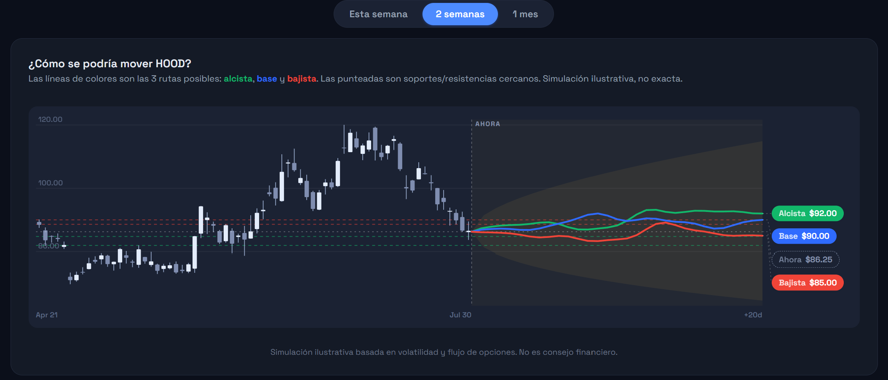

_La MISMA tarjeta de HOOD en '2 semanas': los precios NO cambian ($92 / $90 / $85)._

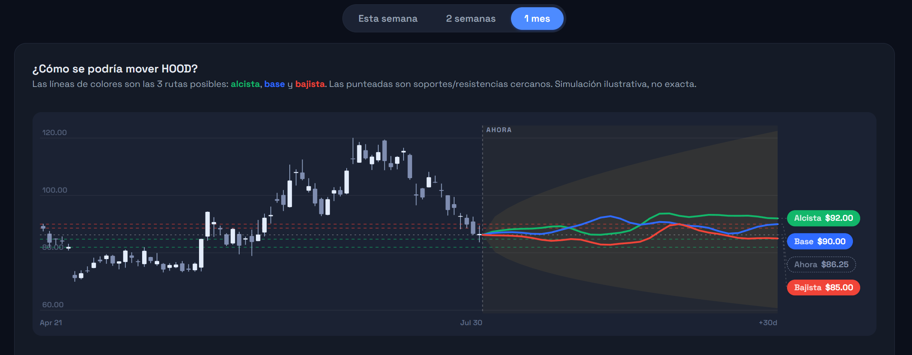

_Y en '1 mes': otra vez idénticos. Los muros son fijos → no se mueven con el plazo._

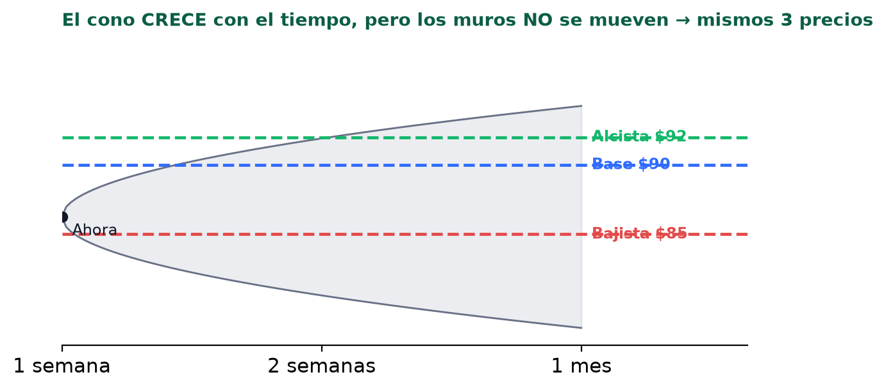

_Por qué: el cono crece con el tiempo, pero los muros no se mueven → mismos 3 precios._

> ⚠️ PENDIENTE de mejora: que los plazos largos puedan alcanzar muros más lejanos, para que los 3 botones se sientan distintos. Hoy los precios son correctos como muros, pero se ven iguales.

## 8. La vista Ideas: el radar del mercado

Mientras la vista **Ticker** analiza UNA acción, **Ideas** es un **radar de TODO el mercado a la vez**: te muestra dónde está entrando el dinero grande AHORA. Un worker escucha el flujo de opciones en vivo (24/5) y guarda cada operación **notable** (prima ≥ **$500,000** = dinero institucional). Ideas lee eso y lo pasa por un **embudo de 2 filtros**:

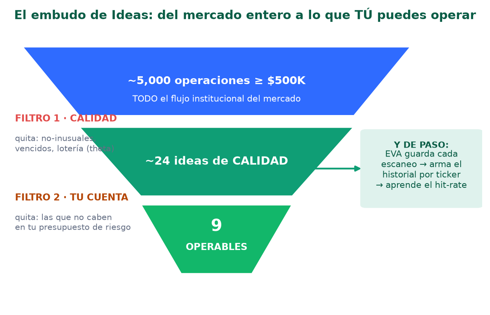

_De miles de operaciones del mercado a las pocas que TÚ puedes operar — y de paso, EVA aprende._

> 🧭 **CÓMO USAR ESTA DIVISIÓN — Ideas** **Qué ves:** dónde entra el dinero institucional grande AHORA, en todo el mercado. **Qué haces:** úsala como RADAR / punto de partida — **NO como lista de compra**. Elige un ticker que te llame (prima grande + historial verde) y pásalo a la vista **Ticker** para el análisis completo antes de decidir. **NO es:** «compra exactamente estos contratos». Es flujo que hizo OTRO; tú validas si tiene sentido para TI y tu cuenta. **Crúzala con:** **(1) el HISTORIAL de la idea** — *por qué:* te dice si ese patrón ya funcionó en ese ticker; *cómo:* prioriza las verdes (hit-rate alto) y desconfía de las rojas. **(2) la vista Ticker del símbolo** — *por qué:* Ideas ve solo UN flujo, Ticker te da la foto completa; *cómo:* abre el ticker y revisa si el sentiment (§5) y los muros (§7) apoyan la misma dirección del flujo. **(3) tu perfil de riesgo** — *cómo:* confirma cuántos contratos caben. *Ejemplo:* Ideas marca flujo bajista grande en INTC con historial 19% (rojo) → ese patrón casi nunca funcionó antes; mejor pásalo aunque la prima sea jugosa.

### El embudo: los 2 filtros

**Filtro 1 — CALIDAD (en el servidor):** de las ~5,000 operaciones notables, quita lo que no sirve para operar (4 razones, abajo). **Filtro 2 — TU CUENTA (en tu navegador):** de las que quedan, deja solo las que caben en tu presupuesto de riesgo. Por eso el encabezado dice, por ejemplo, «9 ideas operables · 15 descartadas».

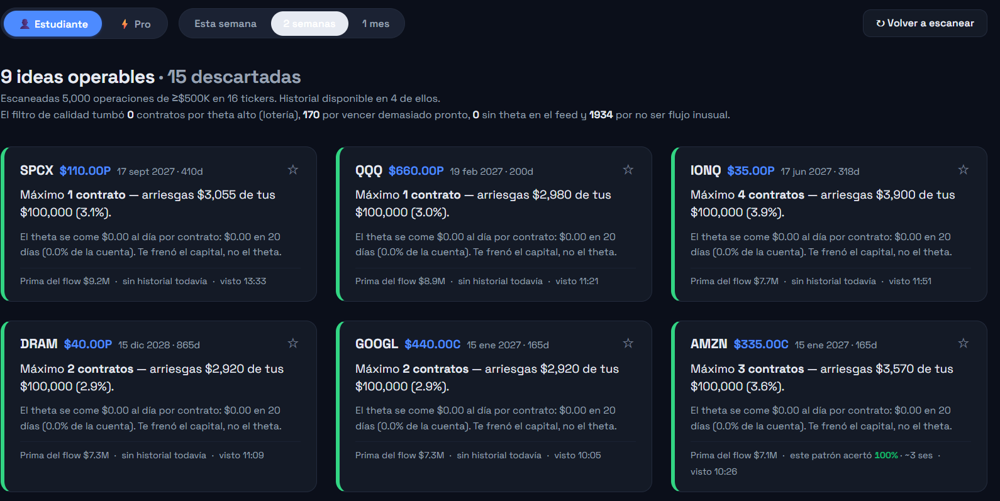

_Ejemplo real: 5,000 escaneadas → el filtro de calidad tumbó 1,934 por no ser inusuales y 170 por vencer pronto → quedan ~24 de calidad → 9 caben en la cuenta._

| El Filtro 1 tumba por… | Qué significa |
|---|---|
| No inusual | Es grande pero NORMAL (no supera el umbral de rareza). La mayoría cae aquí. |
| Vencido / vence hoy | No hay tiempo para que el movimiento se desarrolle. |
| Lotería (theta alto) | Pierde >5% de su valor al día: se derrite, no es posición. |
| Sin theta | El feed no trajo el dato para poder dimensionarlo. |

### Tu perfil de riesgo (el 2º filtro)

Arriba pones el **tamaño de tu cuenta** y el **riesgo por trade** (% máximo a arriesgar). EVA calcula cuántos contratos caben SIN pasarte de ese límite. Tu saldo **nunca sale de tu navegador** — el servidor no lo ve.

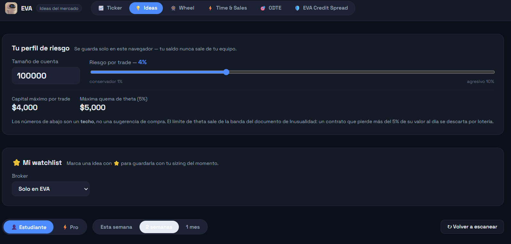

_Cuenta $100,000 · riesgo 4% → máximo $4,000 por trade. Los números son un TECHO, no una sugerencia de compra._

Por eso una idea puede quedar **descartada aunque sea buena**: es demasiado grande para tu cuenta. En la tabla lo ves en la columna **FRENO**: «prima» = te frenó el capital (cabe poco); «no alcanza» = ni un contrato entra (típico de SPX, que cuesta decenas de miles por contrato).

### Cómo leer cada idea

En **Estudiante** cada idea es una tarjeta; en **Pro** es una fila de tabla con todo el detalle. Lo que muestra:

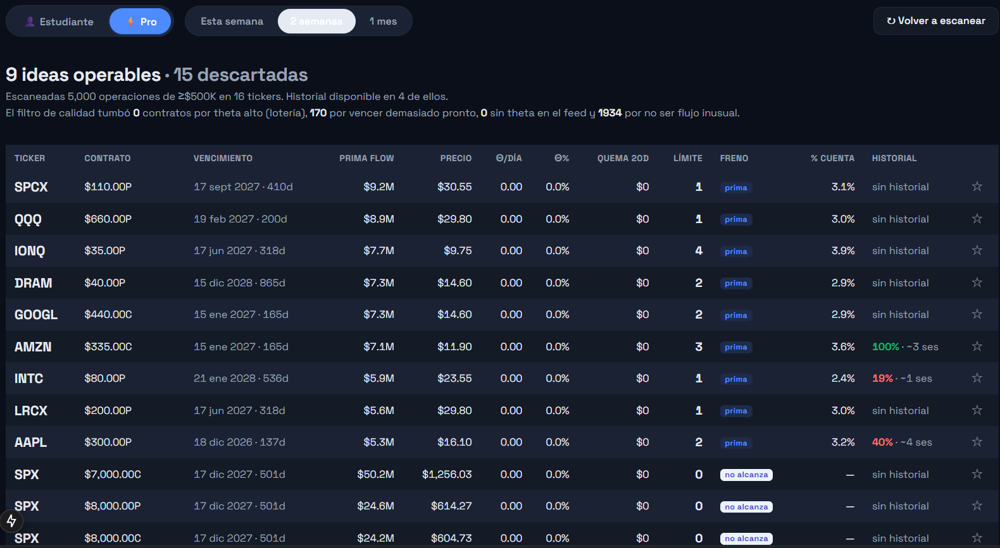

_Vista Pro: cada fila es una idea — contrato, prima del flujo, cuántos contratos caben, el freno, el % de tu cuenta y el HISTORIAL. Abajo, las SPX con FRENO «no alcanza» (no entra ni una)._

| Dato | Qué te dice |
|---|---|
| Contrato + vencimiento | El strike, si es call o put, y cuándo vence (ej. AMZN $335C, 165 días). |
| Prima del flow | Cuánto dinero movió ese flujo institucional (ej. $7.1M). Más grande = más convicción del dinero. |
| Máx. contratos / % cuenta | Cuántos caben en tu riesgo y qué % de tu cuenta arriesgas con ellos. |
| Freno | Qué te limitó: «prima» (el capital) o «no alcanza» (no entra ni uno). |
| Historial | Lo más importante (↓ siguiente sección): si ese patrón funcionó antes en ese ticker. |

### Cómo EVA aprende de cada escaneo

**Cada escaneo guarda el flujo que vio, por ticker.** Con el tiempo eso arma un **historial**, y EVA mide: cuando apareció flujo así antes en este ticker, ¿el precio lo confirmó? Ese es el **hit-rate** de la columna HISTORIAL:

| Lo que ves | Qué significa |
|---|---|
| sin historial todavía | Aún no hay suficientes flujos guardados de ese ticker. Se llena con el uso. |
| 100% · ~3 ses (verde) | Ese patrón acertó el 100% de las veces, y tardó ~3 sesiones en confirmarse. |
| 19% · ~1 ses (rojo) | Ese patrón casi nunca funcionó antes. Bandera roja. |

O sea: Ideas no solo dice «hay flujo aquí», sino «y este tipo de flujo en este ticker históricamente sí/no funcionó». Es el **bucle de aprendizaje** en acción (ver §11). Mientras más uses EVA, más historial acumula y más fiable se vuelve su lectura.

### Cómo se conecta con el resto del agente

Ideas no vive aislada — se apoya en el resto y lo alimenta:

| Se conecta con… | Cómo |
|---|---|
| El sub-agente Inusualidad (§6) | El Filtro 1 de calidad ES la nota de Inusualidad: tamaño, delta, theta, gamma, vencimiento. Solo pasa lo genuinamente raro. |
| Los muros / GEX (§7) | Cuando analizas un ticker que salió en Ideas, ves sus muros de gamma y el movimiento esperado: el contexto de dónde puede frenar el precio. |
| La memoria / aprendizaje (§11) | Cada escaneo alimenta el historial por-ticker que usa el sub-agente 'Confirmación de Precio'. |
| EVA Credit Spread | El flujo de alta convicción que detecta Ideas es la materia prima de la estrategia de credit spread validada. |

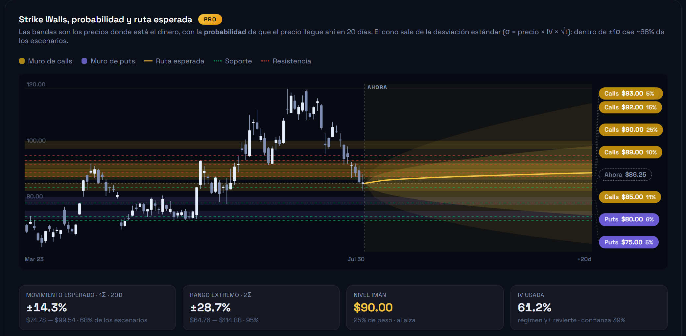

_Al analizar un ticker que salió en Ideas, ves sus muros de gamma (Ticker/Pro): dónde el precio suele frenar o acelerar._

## 9. Wheel, y las otras divisiones

Wheel merece detalle (es una estrategia entera); las otras tres las repaso en breve. Todas comparten el mismo bloque **«cómo usar»** (el recuadro azul), y en «Crúzala con» te explico **por qué** y **cómo** cruzarlas, con ejemplos.

### Wheel — la estrategia de ingreso vendiendo prima

La **Wheel** («la rueda») es una estrategia de INGRESO con **dos patas**: **(A)** vendes un **put cash-secured** — cobras prima y dejas efectivo de colateral (strike × 100); si el precio baja y te **asignan**, te quedas la acción a descuento. **(B)** Con esas acciones, vendes **calls cubiertas** encima — cobras más prima; si te las **llaman**, las vendes con ganancia y vuelves a empezar. Cobras prima en todo el ciclo.

> ⚠️ OJO — hoy la app solo hace la PATA A (vender puts). La PATA B (calls cubiertas sobre acciones que YA tienes) NO está construida todavía. Si tienes acciones (ej. 500 de HOOD = hasta 5 contratos de calls cubiertas), Wheel aún no te ayuda con eso — es una pieza pendiente de desarrollar.

**Cómo elige qué put vender:** primero eliges un **preset de riesgo**, que fija el |delta| del put (≈ probabilidad de que te asignen) y los días al vencimiento (DTE):

| Preset | |Delta| | DTE | Perfil |
|---|---|---|---|
| Conservador | 0.10–0.20 | 30–45 | ~10-20% chance de asignación, strike lejos del precio. |
| Balanceado | 0.20–0.30 | 30–45 | Punto medio: más prima, más chance. |
| Agresivo | 0.30–0.40 | 7–21 | Más prima y más chance de asignación, corto plazo. |

De la cadena se queda con los puts en esa banda que pasan **liquidez** (hay bid, spread ≤25%, OI ≥100), y los **puntúa de 0 a 100** con 5 criterios. Qué es cada uno y **qué mira Wheel**:

| Criterio (puntos máx.) | Qué es y qué mira Wheel |
|---|---|
| Rendimiento anualizado (30) | La prima que cobras frente al efectivo inmovilizado, llevada a un año. Premia el rango SANO (15-35% → 30 pts) y **castiga lo demasiado alto** (>60% → solo 10 pts): una prima altísima suele significar que el mercado espera un desplome. No busca la prima más grande, sino la **mejor pagada por el riesgo**. |
| IV Rank (20) | Qué tan cara está la volatilidad frente a su propio año. Como Wheel VENDE prima, quiere IV CARA: >70 → 20 pts; <30 → 4 pts («te pagan poco por el riesgo»). Es la banda INVERTIDA del resto del agente (que compra opciones y quiere IV barata). |
| Colchón / soporte (25) | Qué tan protegido queda el strike si el precio cae. Máximo (25) si el strike está **bajo un soporte fuerte** (donde el precio ya rebotó antes); 12 si solo hay >10% de colchón sin soporte; 5 si no hay colchón (te asignan fácil). |
| Liquidez (15) | Qué tan fácil entras y sales sin regalar dinero: OI≥500 y spread≤10% → 15 (excelente); OI≥100 y spread≤25% → 5 (justa); menos → 0 (bloqueado). |
| Earnings (10) | Si hay reporte de resultados DENTRO del trade (un reporte puede mover la acción de golpe): fuera del vencimiento → 10 pts; dentro (estimado) → 3; dentro confirmado por la volatilidad → 0. |

> 💡 Dato clave: **Wheel NO usa el scorecard de flujo — ni Victor ni EVA.** Es un sistema APARTE, con su propio score (los 5 criterios de arriba) y su propio universo de acciones. No mira el dinero institucional ni el sentiment — solo «¿esta prima paga bien, con poco riesgo, en una acción sólida?». Conectarle el filtro de convicción de EVA sería algo NUEVO a probar.

> ⚠️ PENDIENTE — Wheel NO está validado: es solo un screener hacia adelante, SIN backtest. No sabemos aún si de verdad da ventaja. Plan: backtestear la rueda (con los mismos gates que el credit spread: out-of-sample, amplitud, costos), y si aguanta → forward-test en vivo. Antes de arriesgar con esto, hay que probarlo.

> 🧭 **CÓMO USAR ESTA DIVISIÓN — Wheel** **Qué ves:** candidatos para vender puts cash-secured (ingreso), con su score 0-100 y cuántos contratos costeas. **Qué haces:** eliges un candidato cuyo strike te gustaría poseer si te asignan, y usas los números como TECHO de sizing (no como sugerencia de compra). **NO es:** una recomendación validada (sin backtest aún), y no cubre las calls sobre acciones que ya tienes. **Crúzala con:** **(1) la vista Ticker del símbolo** — *por qué:* el score de Wheel NO mira el flujo institucional; *cómo:* revisa si el sentiment y los muros GEX apoyan el strike. *Ejemplo:* si vas a vender un put $80 en HOOD, mira si hay un muro de puts / soporte cerca de $80 — si lo hay, el precio tiende a frenarse ahí y baja tu riesgo de asignación. **(2) Tu perfil de riesgo** — *cómo:* confirma que el colateral (strike × 100 por contrato) cabe sin pasarte de tu % máximo por trade.

### Time & Sales — el tape en crudo

Cada operación notable según va pasando, con su agresor (¿compró al bid o al ask?) y sus griegas. Es la materia prima SIN filtrar de la que salen Ideas y el sentiment.

> 🧭 **CÓMO USAR ESTA DIVISIÓN — Time & Sales** **Qué ves:** el flujo bruto en vivo, operación por operación, con agresor y griegas. **Qué haces:** confirmas con tus ojos lo que los scores resumen — ¿de verdad compran calls al ask con urgencia? **NO es:** una señal ya masticada; es data cruda para verificar. **Crúzala con:** **el AI Sentiment (§5) y los sub-agentes (§6)** del mismo ticker — *por qué:* los scores RESUMEN el tape; aquí verificas con tus ojos que el resumen es fiel y no ruido; *cómo:* si el sentiment dice «bajista fuerte», deberías VER en el tape puts comprándose al ask con tamaño. *Ejemplo:* el score marca Convicción 8/10 alcista — bajas al tape y ves 3 bloques de calls al ask de $2M cada uno → confirmado.

### 0DTE — expiran hoy

Opciones que vencen el MISMO día (0 días al vencimiento). Sección en construcción; el contenido lo definimos juntos.

> 🧭 **CÓMO USAR ESTA DIVISIÓN — 0DTE** **Qué ves:** (próximamente) el flujo y los niveles de las opciones que expiran hoy. **Qué haces:** — en construcción. **NO es:** funcional todavía. **Crúzala con:** (cuando esté) **los muros/GEX intradía (§7)** — *por qué:* en 0DTE el gamma de los dealers domina el precio hora a hora, más que en cualquier otro plazo; *cómo:* el precio tiende a imantarse al muro más grande del día, así que ese muro es tu nivel clave para entrar/salir.

### EVA Credit Spread — la estrategia validada

El forward-test EN VIVO (paper) de la estrategia que probamos: vender credit spreads en los días de alta convicción de EVA. Muestra las pruebas, las 5 mejoras y cada jugada registrada.

> 🧭 **CÓMO USAR ESTA DIVISIÓN — EVA Credit Spread** **Qué ves:** la estrategia validada en prueba en vivo: qué entró, su estatus y su resultado. **Qué haces:** la SIGUES para ver si el edge se sostiene hacia adelante — es observación, no operación (aún). **NO es:** una lista de trades para copiar hoy; está en fase de prueba. **Crúzala con:** nada por ahora — esta división ES la prueba, no una herramienta de operar. *Cómo seguirla:* mira si el «Top⅓ de convicción» rinde mejor que el «Bottom⅓» a medida que se acumulan cierres; ese es el edge que queremos confirmar hacia adelante antes de arriesgar dinero real.

## 10. Reglas de liquidez (aviso clave)

> ⚠️ Si la cadena de opciones es POCO LÍQUIDA (bajo volumen/OI, spreads anchos), Eva marca la señal como 'datos poco fiables' y recomienda NO operarla. SIEMPRE lee este aviso primero — una señal sobre datos malos no vale nada.

_Así se ve en la app (HOOD): el **Option Chain completo** — 1,954 contratos, 19 vencimientos, notional total $17.01B, ordenado por Open Interest. Nota clave abajo: «Precio = último trade (Massive no expone bid en este plan)» — por eso EVA estima el bid, y por eso el chequeo de liquidez importa antes de fiarte de una señal._

## 11. Cómo Eva 'aprende' todos los días

Sí, Eva aprende — y aquí está exactamente cómo, dónde y en qué acciones:

| Paso | Qué pasa / dónde |
|---|---|
| 1. Guarda | CADA vez que analizas un ticker (y cada vez que corre el radar /ideas), Eva guarda los flujos que vio. |
| 2. Espera | Deja pasar las sesiones siguientes (hasta ~20 días de mercado). |
| 3. Valida | Mira qué hizo el precio DESPUÉS: ¿validó el flujo (se movió a favor) o lo absorbió? Mide cuánto se movió a favor y en contra, y cuántas sesiones tardó. |
| 4. Puntúa | De ahí sale el sub-agente 'Confirmación de Precio' y la 'Memoria': el HIT RATE histórico de ese ticker. |

**En cuáles acciones corre:** al cargar cualquier ticker (rutas de validación y predicción) y en el radar de Ideas. **Mientras más uses Eva en un ticker, más historial acumula y más confiable se vuelve su lectura de '¿este patrón ha funcionado antes?'.**

_Así se ve en la app (HOOD): «Qué pasó después de cada flow» — cada flujo con su apuesta (alcista / bajista), su premium, y cuánto se movió el precio **a favor** y **en contra** después. Casi todos marcan «Muy reciente»: aún no pasó suficiente tiempo para juzgarlos. Con las sesiones, ese resultado alimenta el hit-rate del ticker._

> 💡 Esto es la base de la CONFIANZA: no 'creemos' que la señal funciona — Eva lo mide contra lo que el precio realmente hizo. (Próximo paso pendiente: un 'chequeo de confianza' que mida el backtest de los 6 sub-agentes uno por uno.)

## 12. Ejemplos de estrategia (educativo, NO consejo)

Cómo la información de Eva **suele mapearse** a estrategias comunes de opciones. Son ejemplos educativos, no recomendaciones:

| Lo que Eva muestra | Estrategia que algunos usan |
|---|---|
| Sesgo alcista + convicción alta | Comprar calls, o un call debit spread (direccional, riesgo definido). |
| Sesgo bajista + convicción alta | Comprar puts, o un put debit spread. |
| Muro de calls fuerte arriba (resistencia) | Call credit spread por debajo del muro (apuesta a que no lo rompe). |
| Muro de puts fuerte abajo (soporte) | Cash-secured put en el soporte (la Wheel) para cobrar prima. |
| IV inflada (Contexto IV bajo) | Vender prima (credit spreads); comprar prima sale caro. |
| IV baja + señal direccional | Comprar prima (calls/puts) sale más barato. |

_Ninguna de estas es una recomendación. Cada estrategia tiene riesgo; el tamaño y la decisión son tuyos._

## 13. Mis recomendaciones (de Claude)

| Recomendación | Por qué |
|---|---|
| Lee SIEMPRE el aviso de liquidez primero | Una señal sobre datos poco fiables no sirve, por buena que se vea. |
| El flujo es una pista, no una confesión | Ese call/put institucional PUEDE ser un hedge, no una apuesta. No lo sigas a ciegas. |
| Gestión de riesgo > cualquier señal | La consistencia se gana NO perdiendo: tamaño de posición, no arriesgues lo que no puedes perder. |
| Usa la Memoria / Confirmación de Precio | Deja que el backtest te diga cuánto confiar en cada ticker, con números. |
| Empieza chico, valida, escala | Prueba la señal con tamaño pequeño antes de apostar en serio. |

_Eva y yo no somos asesores financieros. Damos contexto y análisis; las decisiones de inversión — y su riesgo — son enteramente tuyas._

## 14. Hacia dónde va EVA — 5 mejoras en desarrollo

Estas cinco mejoras son las que separarían a EVA de un simple lector de flujo estático (como el sistema base). No son magia garantizada — son las apuestas donde hay MÁS chance de un salto real. Cada una se construye y se valida con backtest y forward-test antes de confiar en ella.

| Mejora | Qué hace | Qué añade a tu análisis |
|---|---|---|
| 1. Conciencia de régimen | EVA sabe en qué 'clima' está el mercado (tranquilo, volátil, en tendencia) y ajusta su lectura según eso. | Una señal que en promedio es ruido puede ser FUERTE en un régimen específico. Deja de tratar todos los días igual. |
| 2. Lado del dealer (GEX) | Ve hacia dónde los market makers están FORZADOS a comprar/vender para cubrirse (gamma), no solo quién opera. | Anticipa squeezes (gamma negativa acelera el precio) y frenos (gamma positiva lo revierte) que el flujo por sí solo no muestra. Es la base del 'Power Monday'. |
| 3. Bucle de aprendizaje | Mide sus propios aciertos y RE-CALIBRA sus pesos sola con el tiempo. | Mejora continua. El sistema base es estático; EVA aprende de lo que funcionó y lo que no. |
| 4. Resultados como distribución | En vez de un '80/100', dice: '45% de aciertos, resultado típico 0%, y 5% de chance de +300%'. | Honestidad para dimensionar el riesgo. Un número solo engaña; la distribución te dice la verdad de lo que puede pasar. |
| 5. Motor señal → vehículo | No solo dice 'alcista'; dice 'y dada esta IV, la mejor forma de jugarlo es este spread', no un call pelado. | Convierte el análisis en una acción concreta: del QUÉ (dirección) al CÓMO (la estructura óptima). |

_Mejoras en desarrollo, NO promesas. Cada una se valida con datos antes de confiar en ella. El objetivo es un salto real y medido, no una ilusión — y si los datos dicen que una no sirve, se descarta con honestidad._

## 15. Glosario

| Término | Qué es |
|---|---|
| Agresor (ask/bid) | Quién forzó la operación: al ASK = comprador agresivo; al BID = vendedor agresivo. |
| Premium | El dinero total de una operación (precio × contratos × 100). |
| Notional | El valor nominal expuesto (OI × 100 × strike). |
| Open Interest (OI) | Contratos abiertos vivos en ese strike. |
| Delta | Cuánto se mueve la opción por $1 del subyacente. Cerca de ±1 = muy direccional. |
| Gamma | Qué tan rápido cambia la delta. Zona institucional ~0.01-0.08. |
| Theta | El decaimiento diario por el paso del tiempo (juega en contra del comprador). |
| IV (volatilidad implícita) | La volatilidad que el mercado le pone al precio de la opción. |
| GEX (Gamma Exposure) | Dónde se concentra la gamma de la cadena = los 'muros' de soporte/resistencia. |
| Muro | Un strike con tanto dinero/gamma que el precio tiende a frenarse ahí. |
| Cono (±1σ/±2σ) | El rango de precio esperado por estadística (68% / 95%). |
| Multileg | Una operación de varias patas a la vez (spread) — más difícil de leer que una sola pata. |
| LEAP | Opción de vencimiento largo (~1 año o más). |
| Hit rate | % de veces que el precio validó el flujo históricamente (el backtest de Eva). |
| n (tamaño de muestra) | Cuántos casos entraron en una prueba. Un % sobre n grande es más confiable que sobre n chico. |

## 16. Herramientas y plataformas que usamos

Todo lo que hace funcionar a EVA, y para qué sirve cada pieza. Con honestidad marcamos cuáles están **en vivo** en la app y cuáles usamos **alrededor** del proyecto o estamos **evaluando** — para no dar por conectado lo que aún no lo está.

| Plataforma | Para qué la usamos | Estado |
|---|---|---|
| Claude / Claude Code (Anthropic) | El agente que construye, analiza y explica: escribe el código, corre los backtests y arma este manual. | En vivo (EVA) |
| Massive (ex-Polygon.io) | Fuente PRIMARIA de datos de opciones: cadenas, Time & Sales (el firehose de operaciones), barras diarias, logos y fundamentales. De aquí sale casi todo el flujo. | En vivo (EVA) |
| Redis | Memoria rápida en la nube: el búfer de flujo notable de Ideas y los ledgers de los forward-tests (credit spread y wheel). | En vivo (EVA) |
| Railway | El hosting en la nube: sirve la app y corre los cron (los forward-tests que registran operaciones de papel cada día). También provee el Redis. | En vivo (EVA) |
| RSS (feeds de noticias) | Titulares y catalizadores del activo (la tarjeta de Noticias). Las fuentes están en docs/RSS-Feed.md. | En vivo (EVA) |
| Databento | Datos de mercado de grado institucional (Time & Sales). Es la fuente de datos del fork de Victor (smart-money-flow); en la web EVA hoy usamos Massive. | Fork de Victor |
| FMP (Financial Modeling Prep) | Fundamentales y estados financieros de empresas (earnings, ratios). | Evaluada — no cableada aún |
| FRED (St. Louis Fed) | Datos macro oficiales (tasas, inflación, empleo) para el contexto de mercado. | Evaluada — no cableada aún |
| Finnhub | Datos de mercado, noticias y fundamentales — alternativa/complemento para cubrir huecos de datos. | Evaluada — no cableada aún |
| Dribbble | Inspiración de diseño (UI/UX): de ahí salen ideas visuales como el rediseño 'Agente MK II'. No es fuente de datos. | Diseño |

_«Evaluada — no cableada aún» = la consideramos o probamos, pero HOY no alimenta la app en vivo. Lo aclaramos para no vender humo: si un dato no viene de una fuente conectada, todavía no está dentro de EVA._
